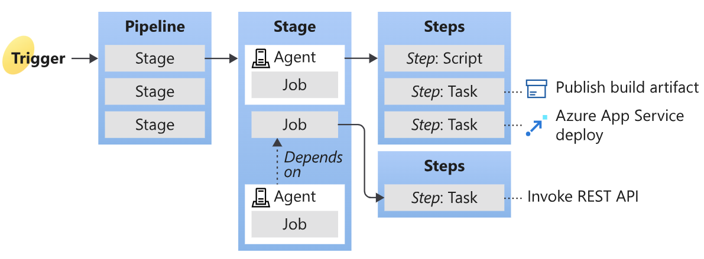
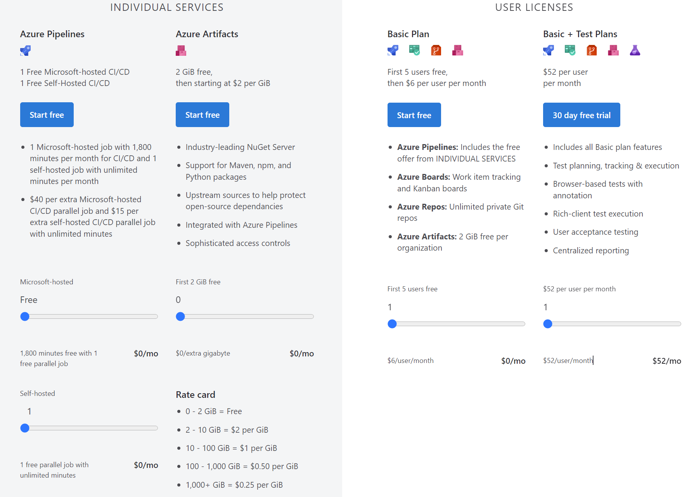

Key concepts for new Azure Pipelines users
=============================================

각 파이프라인은 여러개의 스태이지를 포함할 수 있고 스태이지 안에는 여러개 잡을 실행 할 수 있다. 잡마다 에이전트(VM)가 할당되어 처리된다.

## 가격정책

# Microsoft 호스팅 에이전트 (Microsoft-Hosted)

 - 1 Free Microsoft-hosted CI/CD
    - 파이프라인이 하나는 무료 (여러개 잡이 하나에 파이프라인에서 실행 가능 하기 때문에 병렬처리 가능)

 - 1 Microsoft-hosted job with 1,800 minutes per month for CI/CD
    - 셀프 호스트되는 VM 사용하는 파이프라인은 실행 시간을 기준으로 달마다 1800 분 무료 
 - $40 per extra Microsoft-hosted CI/CD parallel job extra self-hosted CI/CD parallel job with unlimited minutes
    - 1개 무료 외 파이프라인 추가 시 40달러 (자동으로 관래해줘서 높은 가격 실행 시간제한은 없다.)

# 자체 호스팅 에이전트 (Self-Hosted)
 - 1 Free Self-Hosted CI/CD
   - 파이프라인이 하나는 무료 (여러개 잡이 하나에 파이프라인에서 실행 가능 하기 때문에 병렬처리 가능)
 - 1 self-hosted job with unlimited minutes per month 
   - 1 달 시간 실행 시간 제한 없음 
 -  $40 per extra Microsoft-hosted CI/CD parallel job and $15 per
   - 1개 무료 외 파이프라인 추가 시 15달러 
 

위 두개의 제일 큰 차이점 Microsoft 호스팅 에이전트는 자동으로 VM 만들어지고 잡을 처리한 후 폐기되는 반면 자체 호스팅 에이전트는 사용자가 직접 VM 을 만들어서 셋팅해야 한다. 

# Microsoft 호스팅 에이전트 vs. 자체 호스팅 에이전트 (비교표)

| 종류                    | Microsoft 호스팅 에이전트                | 자체 호스팅 에이전트                    |
|--------------------------|--------------------------------------|--------------------------------------|
| 유지보수 및 업그레이드      | 자동으로 처리                         | 필요에 따라 직접 설치                  |
| 가상 머신 수명 주기       | 각 실행마다 새로운 가상 머신 생성 후 폐기 | 유지됨                                 |
| 실행 환경                | Azure의 안전한 플랫폼 위에서 실행       | 조직 내에서 운영되며 단일 에이전트만 호스팅 |
| 보안 고려 사항           | 외부 엔터티가 타겟팅할 수 없음 (공용 IP 주소 미할당) | 내부 리소스 접근을 위한 Azure 지리의 IP 주소 범위 화이트리스트 필요 (일부 고객과 공유될 수 있음) |
| CIS 하드닝 벤치마크      | 지원되지 않음                         | 가능 (자체 호스팅 에이전트 또는 스케일 세트 에이전트로 생성) |
| 빌드 속도                | 일부 빌드에 대한 성능 이점 미제공 (캐시 및 설정 유지되지 않음) | 캐시 및 설정이 유지되어 성능 향상 가능    |
